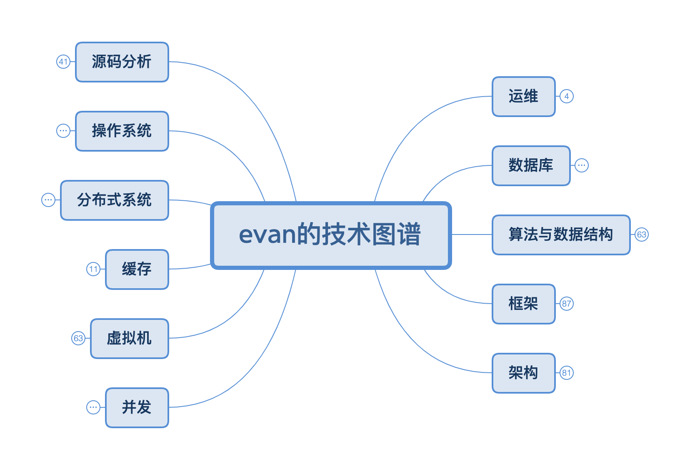

# knowledge-map
Evan的知识图谱

* 目的：用于个人整体知识体系的构建，便于技术的认知体系化，**知识图谱应该随着经验的增长不断变化，不断精炼**
* 期望：希望能给读者提供一个图谱范例，后续便于读者建立属于自己的一个知识图谱
* 时间：至21年11月，这个知识图谱我也修补了2年多了，内容较多，感兴趣的同学可以参考一下
* 食用方式：
  * 工具下载：该图谱使用XMind进行构建，[福利版本点这里](https://xclient.info/s/xmind.html)
  * 阅读方式：阅读的正确方式应该是找到一个感兴趣的子主题进行下钻，后逐步聚焦

